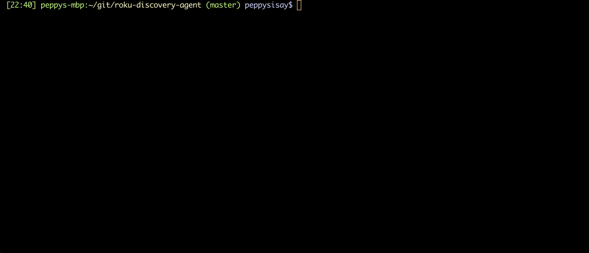

# roku-discovery-agent
Collects metadata from active Roku TV's on the local area network and logs to standard output, with options to publish to a [Google Cloud Pub/Sub Topic](https://cloud.google.com/pubsub)

## Installation
Build binary executable:
```shell script
go build -o agent cmd/agent/main.go
```
## Running
Run the executable:
```shell script
./agent
```

To publish metrics to a Google Cloud Pub/Sub Topic:
```shell script
./agent -p your-project-id -t your-topic-id
```

## Data Collected
```
{
  "active_app": {
    "name": string
  },
  "device": {
    "udn": string,
    "serial_number": string,
    "device_id": string,
    "vendor_name": string,
    "model_name": string,
    "model_number": string,
    "friendly_device_name": string,
    "uptime": int
  },
  "media_player": {
    "state": string,
    "position": string
  }
}
```

### Demo
